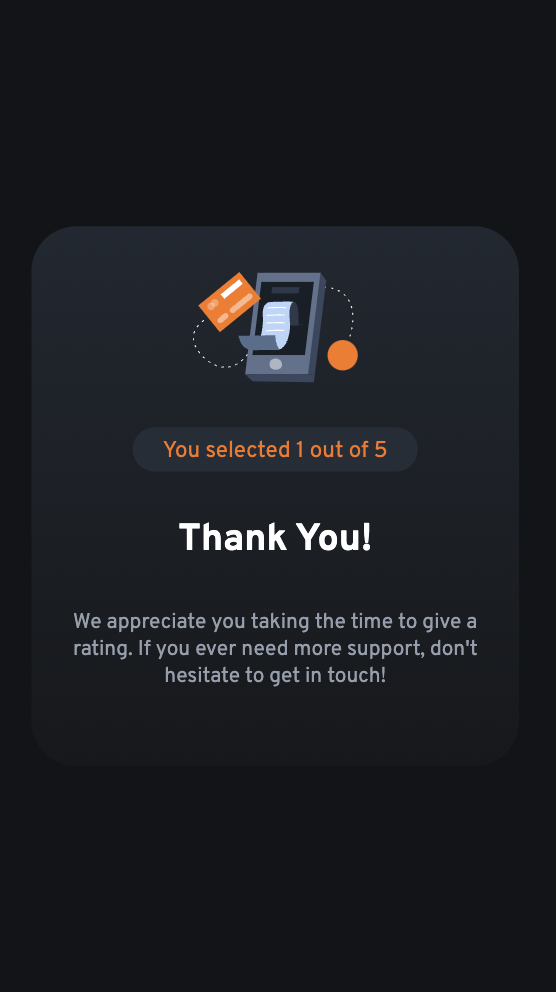
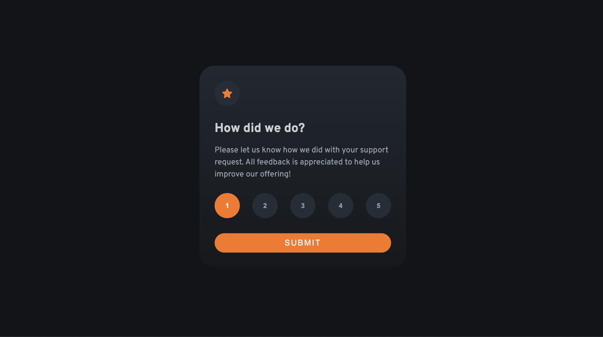

# Frontend Mentor - Interactive Rating Component

---

## Table of Content

* [Useful Links](#useful-links)
* [Mobile version](#mobile)
* [Desktop version](#desktop)

---

### Useful Links 

* [FM - Interactive Rating Component](https://www.frontendmentor.io/challenges/interactive-rating-component-koxpeBUmI)

* [Vercel: My Solution](https://js-fm-01-interactive-rating-component-main.vercel.app/)

--- 
### Mobile version 

--- 
### Desktop version 

